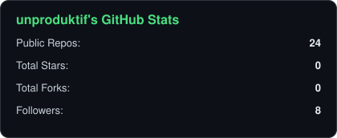
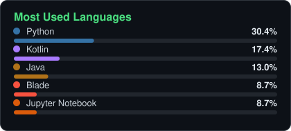

# hey, i'm dodi 👋

undergrad spending way too much time staring at monitors and over-engineering simple things.
documenting the unfiltered process of figuring it all out.

---

### about me

- 🎓 Informatics Engineering undergrad at **University of Mataram**
- 🌱 Currently building side-projects across web, mobile, and machine learning
- 🤿 Off-screen: diving, hiking, and photography/videography
- ⚡ Fun fact: I'll happily over-engineer a simple script if it means learning something new

### tech stack

### github stats

  
  

  

---

the stats cards above are generated and committed by a GitHub Actions workflow in this repo (<code>.github/workflows/profile-summary-cards.yml</code>), refreshed daily — no third-party widget dependency.

